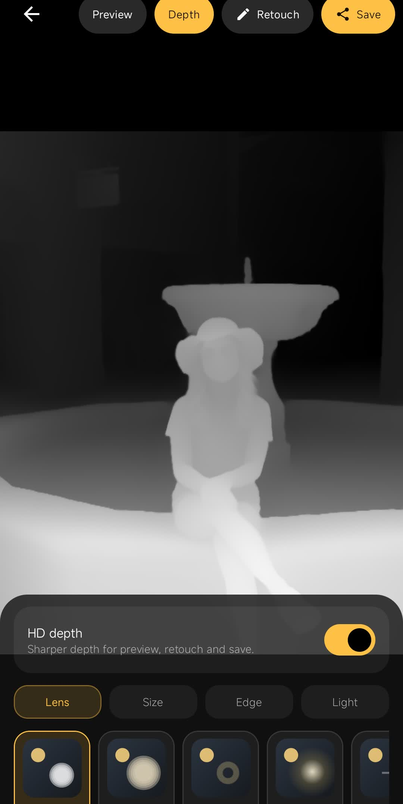
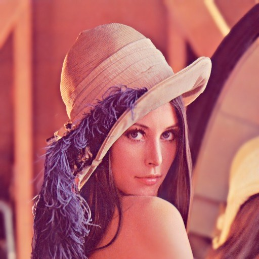
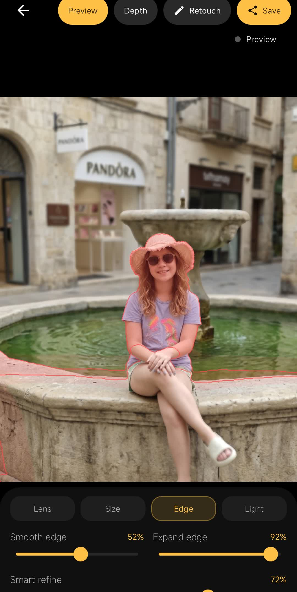
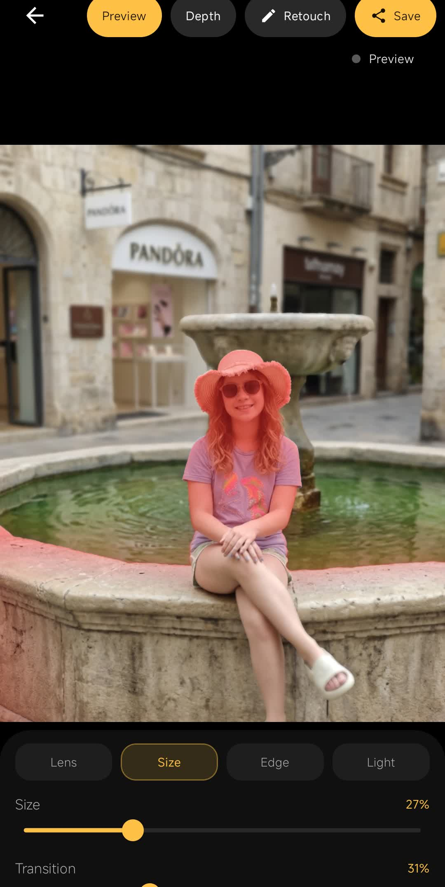
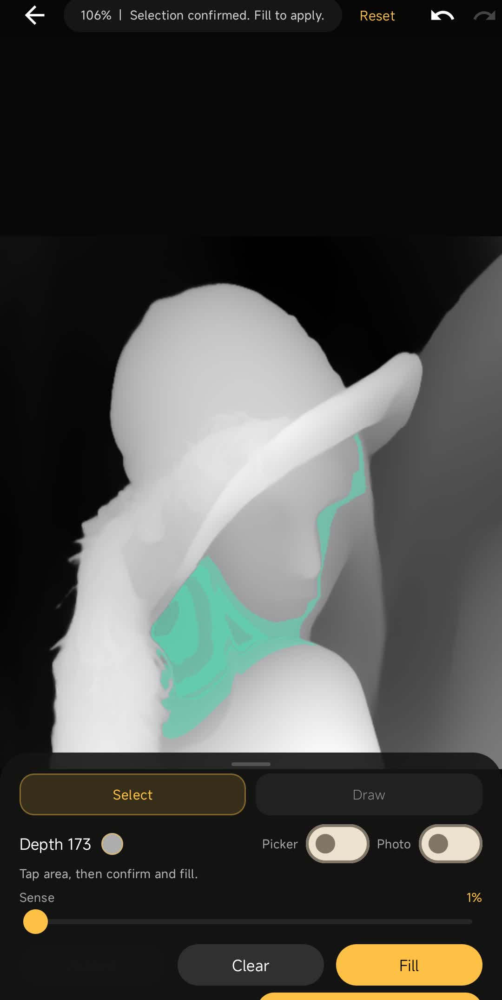

# CineDepth Pro: Z-Depth Computational Photography Engine

[](https://developer.android.com/)
[](https://opensource.org/licenses/Apache-2.0)
[](https://github.com/DepthAnything/Depth-Anything-V2)

**CineDepth Pro** is a state-of-the-art computational photography engine that brings physically-accurate, professional-grade lens simulations to mobile devices. By combining **SOTA Machine Learning** with **GPU-accelerated AGSL shaders**, it transforms standard smartphone images into high-end cinematic captures with realistic optical artifacts.

---

## 🖼️ Sample Results

### High-Resolution Scene Analysis
| Original Photo | AI Depth Estimation (HD) | Final 4K GPU Render |
|:---:|:---:|:---:|
|  |  |  |

> *Example showing a complex outdoor scene with multi-layered depth and realistic bokeh falloff.*

### Retouching Workflow (Smart Selection & Edge Refinement)
| Transition Mask | Edge Expansion | Refined Depth (Lena) |
|:---:|:---:|:---:|
|  |  |  |

---

## 🚀 Key Technical Features

### 1. High-Fidelity GPU Shader Pipeline (AGSL)
The core rendering engine is built on the **Android Graphics Shading Language (AGSL)**, enabling real-time preview and 4K rendering of complex optical effects:
*   **Anamorphic Mode (Cinema-Style):** Custom lens engine (Lens Type 6) simulating 1.65x horizontal oval bokeh, horizontal flare streaks (12-tap accumulation), and cyan-blue chromatic aberration.
*   **Golden Angle Bokeh:** Implements a high-sample-count (up to 72) disc blur using the golden angle for superior bokeh distribution.
*   **Optical Artifacts:** Simulates **Chromatic Aberration (CA)**, **Cat's-Eye Vignetting**, and **Highlight Bloom** (glow on specular highlights).

### 2. SOTA Depth Estimation & Lens Mastering
*   **Lens Presets (Master Profiles):** One-tap profiles for iconic glass:
    *   *Noctilux:* High contrast, creamy bokeh, strong vignette, warm highlights.
    *   *Helios 44-2:* Swirly "bubble" bokeh, low contrast, vintage flare.
    *   *CinemaScope:* Full anamorphic profile with signature horizontal flares.
    *   *G-Master:* Clinical precision with neutral, modern bokeh characteristics.
*   **Bilateral Edge Refinement:** A custom refinement shader that "snaps" low-resolution ML depth maps to high-resolution RGB edges using luma-weighted bilateral filtering.

### 3. Pro-Grade UX & Metadata Integrity
*   **Interactive Comparison Slider:** A draggable A/B split-screen divider allowing real-time, side-by-side quality assessment of the bokeh effect.
*   **EXIF Preservation:** Robust preservation of 20+ key metadata tags (GPS, Camera/Lens make, ISO, Focal Length) from the source photo to the final 4K output.
*   **Real-time Performance Benchmarking:** Integrated instrumentation tracking depth inference latency, shader pass timing (ms), and memory heap pressure.

---

## 📂 Project Architecture

```text
├── android_ui_prototype/   # Pro Android App (Kotlin, Compose, AGSL)
│   ├── ui/retouch/         # MVI ViewModel & Retouching Canvas
│   └── ui/blur/            # GPU Shaders & TFLite Depth Pipeline
├── research_prototype/     # Python R&D (Optical Proof-of-Concept)
│   ├── lens_sim.py         # Bokeh & Lens character engine
│   ├── depth_engine.py     # SOTA Depth-Anything-V2 integration
│   └── main.py             # Interactive desktop prototype
├── ultra_depth_server/     # High-resolution Python inference backend
└── docs/assets/            # Visual showcase & documentation assets
```

---

## 🛠️ Technical Deep Dive

### 1. The AGSL Anamorphic Shader
The anamorphic implementation required a custom elliptical sampling kernel to simulate the unique compression of cinema lenses:
```glsl
// Anamorphic Oval Sampling math
float horizontalStretch = 1.65;
float verticalCompress = 0.58;
vec2 ovalOffset = vec2(offset.x * horizontalStretch, offset.y * verticalCompress);
// Horizontal flare streak accumulation (12-tap)
vec3 flareTint = vec3(0.0, 0.4, 0.8) * highlightIntensity;
```

### 2. High-Performance Benchmarking
To maintain 60fps while processing 12MP images, the app instruments the entire render cycle using `System.nanoTime()`:
*   **Depth Inference:** Tracks the TFLite latency on the NPU/GPU.
*   **Shader Pass Time:** Measures the combined time for refinement, contour matting, and bokeh accumulation.
*   **Memory Pressure:** Monitors JVM/Native heap to prevent OOM errors during high-res 4K exports.

### 3. Metadata Preservation logic
CineDepth ensures that the resulting photo isn't just a "pretty image" but a "real photo" by copying the original EXIF block and stamping **CineDepth Pro** as the software tag, maintaining the photographic provenance of the file.

---

## 🚀 Future Roadmap

### GitHub (Engineering Showcase)
- [ ] **Hair & Fine Detail Refinement:** Advanced matte generation for complex foreground subjects.
- [ ] **Automated Performance Testing:** CI/CD integration for shader pass latency monitoring.
- [ ] **Unit Tests:** Coordinate mapping, EXIF integrity, and MVI state-machine validation.

### Play Store (Product Strategy)
- [ ] **Pro Tier Unlock:** Iconic presets (Noctilux, Helios, CinemaScope) and 4K export functionality.
- [ ] **Remote HD Inference:** Optional backend for desktop-class depth estimation.

---

## 🤝 Contributing
This project is part of a professional engineering showcase. While I am not currently accepting pull requests, I am open to technical discussions regarding computational photography and GPU rendering.

## 📄 License
This project is licensed under the Apache License 2.0 - see the [LICENSE](LICENSE) file for details.

---
*Created by [Weiyuan Kong/GitHub Handle] — Senior Mobile & CV Engineer Showcase.*
